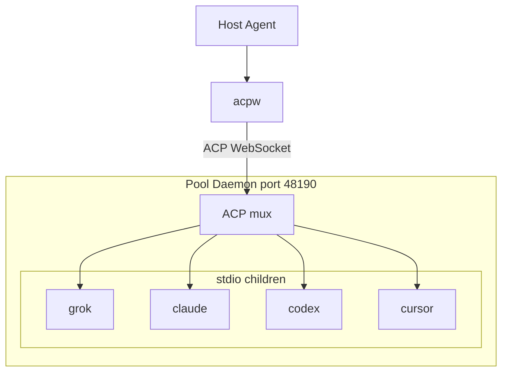
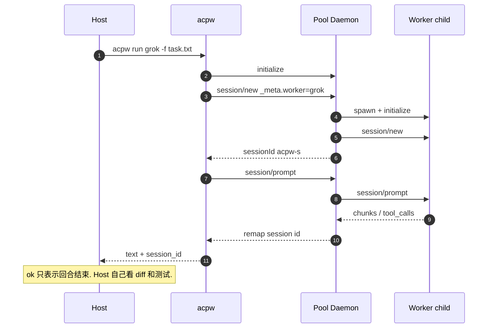
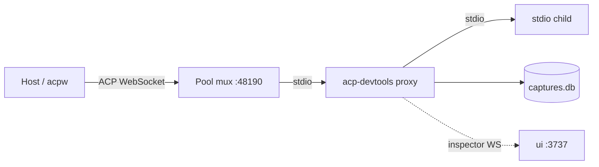

# acp-workers

本机一条 [ACP](https://agentclientprotocol.com) WebSocket，底下挂多个 agent 进程。Host 规划、派发、验收；worker 只执行。

仓库同时发布两份产物：[acp-workers skill](skills/acp-workers/)（agent 指令）和 [`acpw` CLI](packages/acpw/)（实现）。可只装其中一份。

[](https://skills.sh/ticoAg/acp-workers)

## 架构

Host 只跟 `acpw` 说话。`acpw` 拨 `ws://127.0.0.1:48190`；daemon 翻译三套 id（host / child / session），按需 spawn stdio child。Host 看不到自己打到了哪个进程。



`acpw up` 起这条 socket；`acpw up grok claude` 顺带预热 child；`acpw run` / `acpw ping` 在 daemon 还没起时会自己起一份。`--no-pool` 是每个 worker 自己的 gateway / `grok agent serve` 逃生口。线路契约见 [`docs/pool-protocol.md`](docs/pool-protocol.md)。

公开 `session_id`（`acpw-s` + 16 hex）活过连接、child 和 daemon 重启。续会话带 `--session-id`。三档耐久见 [pool.md](skills/acp-workers/references/pool.md)。

## 支持的 Agent

Registry 名默认等于 kind。同 kind 再开一个进程：`acpw add grok-b --kind grok`。

| 名字 | 框架 | 二进制 | Pool 子进程 | `--no-pool` |
| --- | --- | --- | --- | --- |
| `grok` | [Grok Build](https://x.ai/build) | `grok` | `grok agent --always-approve --no-leader stdio` | `serve` 48191 |
| `claude` | [Claude Code](https://docs.anthropic.com/en/docs/claude-code) | `npx` | [`@agentclientprotocol/claude-agent-acp`](https://www.npmjs.com/package/@agentclientprotocol/claude-agent-acp) | `48192` |
| `codex` | [Codex CLI](https://github.com/openai/codex) | `npx` | [`@agentclientprotocol/codex-acp`](https://www.npmjs.com/package/@agentclientprotocol/codex-acp) | `48193` |
| `cursor` | [Cursor CLI](https://cursor.com/docs/cli/acp) | `cursor-agent` | `cursor-agent acp` | `48194` |

`mock` 是包内 echo agent，给测试用，`acpw ls` 默认不列出。至少一个二进制在 `PATH` 上即可；`acpw doctor` 查缺哪一个。

## 工作流



```bash
acpw doctor && acpw ls
acpw up grok --cwd "$PWD"
acpw run grok -f /tmp/task.txt
acpw run grok -f /tmp/next.txt --session-id acpw-s…
acpw down grok    # 只停一个 child
acpw down         # 停 daemon
```

只派 `acpw ls` 里 `enabled` 且 `allowed` 的 worker。本机允许的 kind：`acpw allow set grok cursor`。

默认绑 `0.0.0.0:48190`，客户端拨回环。Child 是 always-approve，`server-key` 明文过线——别把端口放到不可信网络。`acpw selfcheck` 会报 `exposure` 告警。

## 和 [acp-devtools](https://github.com/maksugr/acp-devtools) 合用

两者不互相替代，也没有代码耦合。`acpw` 负责派发；[acp-devtools](https://github.com/maksugr/acp-devtools) 负责把 ACP 帧抓下来看。接缝是 daemon 拉 child 的那条 `stdio_argv`。

| | 本项目 | acp-devtools |
| --- | --- | --- |
| 角色 | Host 眼里的一个 ACP agent：一条 WebSocket，底下挂多个 child | editor/client 和 **一个** agent 之间的透明 stdio 代理 |
| 解决 | 并发派发、公开 `session_id` 续上、三套 id 翻译 | 时间线、spec 校验、延迟、两次会话 diff、回放、只读 MCP |
| 入口 | `ws://127.0.0.1:48190/ws?server-key=…` | `acp-devtools proxy …`（stdio）。Inspector 另有自己的 WS，不是 ACP |

两套 WebSocket 不要混：`48190` 是 ACP；devtools 的 ephemeral 端口只给 UI 推帧。



### 接法：包一层 proxy

`acpw add` 不写 `stdio_argv`。在 `~/.config/acp-workers/registry.json` 里覆盖，然后让 daemon 重新 spawn 该 child：

```json
"grok": {
  "kind": "grok",
  "enabled": true,
  "stdio_argv": [
    "acp-devtools", "proxy", "--session-name", "grok",
    "--", "grok", "agent", "--always-approve", "--no-leader", "stdio"
  ]
}
```

`--` 不能省：后面的 `--always-approve` 否则会被当成 proxy 自己的旗标。Claude / Codex / Cursor 同样包，把 `--` 后面换成「支持的 Agent」表里的 pool 子进程命令。`acp-devtools` 要在 `PATH` 上（`npm install -g acp-devtools`）。改完：

```bash
acpw down grok
acpw up grok --cwd "$PWD"
acp-devtools ui          # http://127.0.0.1:3737/ ，会发现这条 live capture
acpw run grok -f /tmp/task.txt
acp-devtools list
acp-devtools inspect 23 --method session/prompt
acp-devtools validate 23
acp-devtools stats 23 --by-method
```

`acpw doctor` 仍查原来的 agent 二进制，不查 proxy。spawn 失败看 `_pool/server.log` 里有没有 `acp-devtools: spawned`。proxy 的 stderr 进这份日志；不要开 `--log pretty`，否则每一帧都打进去。`--no-pool` 的 claude / codex / cursor 走同一条 `stdio_argv`，同样能包；`acpw up grok --no-pool` 是 `grok agent serve`（原生 WS），包不住。

### 抓包里能看见什么

Proxy 夹在 **daemon ↔ child**，不是 host ↔ daemon。因此：

- **能看见**：child 的 `initialize`（`clientInfo` 是 `acpw-pool`）、`session/new`、prompt、流式 chunk、tool call、`session/request_permission`。`_meta` 原样转给 child，所以帧里有 `_meta.worker`。
- **看不见**：host 侧的公开 `session_id`（`acpw-s…`）、daemon 自己的 `initialize`（`agentInfo: acpw-pool`）、`worker/up` / `worker/down`、host ↔ daemon 的 id 重映射。
- 对照公开 id 和 child 原生 id：`~/.local/state/acp-workers/_pool/sessions.json` 是 `acpw-s… → {worker, native, cwd}`。
- 一个 child 活多久，devtools 那条 capture 就多长。多次 `acpw run grok` 叠在同一条里；要切开就 `acpw down grok` 再起。

抓包会把 prompt 和 tool 结果写进 `~/.acp-devtools/captures.db`。导出分享前用 `acp-devtools export`（默认脱敏 auth header，**不**脱敏文件内容和 prompt）。

### 其它合用方式

| 目的 | 做法 |
| --- | --- |
| 同一 prompt 对比两个 agent | 两个 child 都包上，各 `acpw run` 一次，`acp-devtools diff <a> <b>` |
| 分清是 pool 的问题还是 agent 的问题 | 绕开 pool，直接 `acp-devtools mock-editor --script golden.json -- grok agent --always-approve --no-leader stdio` |
| 测 mux、不烧 token | registry 里把某个 worker 的 `stdio_argv` 设成 `acp-devtools mock-agent --session N`（录音必须含 daemon 那次 `initialize`） |
| 让 host 自己查抓包 | 给 host 配 `acp-devtools mcp`（stdio、只读）。这和 `acpw` 无关，skill 也不管 MCP |

合不上的：Zed / JetBrains 经 acp-devtools 打到 pool（编辑器要 stdio，pool 是 WebSocket）；用 devtools 当 `48190` 的 ACP 客户端；指望抓包里出现 `acpw-s…`。Pool 本身的正确性继续靠 `acpw selfcheck` 和本仓库测试。

默认不要包 proxy。排障、对比 agent、怀疑线路不合 spec 时再包。

## 安装

```bash
npx skills add ticoAg/acp-workers --skill acp-workers
bash <installed-skill-dir>/scripts/ensure-acpw.sh --completion
```

或只装 CLI：

```bash
uv tool install "git+https://github.com/ticoAg/acp-workers#subdirectory=packages/acpw"
acpw install
```

引导脚本幂等，带版本闸门。路径、卸载顺序见 [install.md](skills/acp-workers/references/install.md)。更新：`npx skills update acp-workers`，再 `ensure-acpw.sh --update`。版本线见 [CHANGELOG.md](CHANGELOG.md)。

<details>
<summary>让 agent 代装</summary>

```
把 acp-workers skill 和它的 CLI 装好，然后核验：

1. `npx skills add ticoAg/acp-workers --skill acp-workers`
2. `bash .agents/skills/acp-workers/scripts/ensure-acpw.sh --completion`
   （若你的 harness 把 skill 装到别处，改成那个路径）
3. 两条命令各打印一行 JSON。引导脚本幂等且带版本闸门：`already` 表示已是当前版本，`installed` / `updated` 表示它动手了。`"ok": false` 时按 `notes` 做——不要另想装法，也不要用 pip 装。
4. 脚本会替你跑 `acpw selfcheck`；要的是 `"selfcheck": "pass"`。想看完整报告再自己跑一次 `acpw selfcheck`。`exposure` 告警是预期的——worker 默认绑 `0.0.0.0`。`failed` 里有东西才不正常。
5. 派活之前先读 `.agents/skills/acp-workers/SKILL.md`。

把两行 JSON 原样贴回来。没有它们不要声称成功。
```

</details>

## 仓库

| 路径 | 作用 |
| --- | --- |
| [`skills/acp-workers/`](skills/acp-workers/) | Skill 载荷：`SKILL.md`、scripts、references |
| [`packages/acpw/`](packages/acpw/) | `acpw` CLI |
| [`docs/pool-protocol.md`](docs/pool-protocol.md) | Daemon 线路契约 |

## 开发

```bash
cd packages/acpw
uv sync
uv run pytest
uv run ruff check . && uv run ruff format --check .
uv tool install --editable .
```

测试驱动隐藏的 `mock` adapter，不碰真实 agent 二进制，也不碰真实 registry（`ACPW_CONFIG_DIR` / `ACPW_STATE_DIR` + `free_port()`）。

## 许可证

MIT
